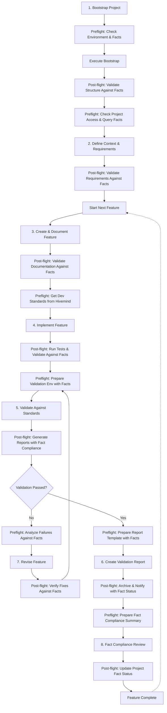

# Dot AI Development Workflow

This document outlines the standardized development workflow for projects using the Dot AI framework. Following this workflow ensures that all features are properly documented, implemented according to standards, and validated before being considered complete.

## Workflow Overview



## Fact Validation

The Dot AI workflow integrates with the hivemind knowledge base to ensure all development follows established standards and best practices. Facts are queried at key points in the workflow to validate decisions and implementations against organizational standards.

### Fact Categories

Facts are organized into categories that align with different aspects of development:
- **FRONTEND**: UI frameworks, component libraries, styling approaches
- **BACKEND**: Server frameworks, API patterns, service architecture
- **DATABASE**: Database systems, ORM tools, data modeling practices
- **FULL_STACK**: Cross-cutting concerns and full-stack patterns
- **DESIGN_PATTERN**: Software design patterns and principles
- **ARCHITECTURE_PATTERN**: System architecture patterns and decisions
- **TESTING_PATTERN**: Testing strategies and methodologies
- **PROJECT_STRUCTURE**: Directory organization and file naming
- **CODE_STYLE**: Formatting, naming conventions, and style guides
- **DEPLOYMENT**: Deployment strategies and environments
- **SECURITY**: Security practices and requirements
- **DOCUMENTATION**: Documentation standards and requirements

### Fact Strictness Levels

Facts have different strictness levels that determine how they should be applied:
- **REQUIRED**: Must be followed without exception
- **RECOMMENDED**: Should be followed unless there's a compelling reason not to
- **OPTIONAL**: Suggested practices that can be adopted as appropriate

## Workflow Steps

### Preflight and Post-flight Hooks

Preflight and post-flight hooks are automated processes that run before and after each workflow step to ensure consistency, quality, and efficiency throughout the development process.

**Preflight Hooks** run before a step begins to:
- Verify prerequisites are met
- Check for locks and permissions
- Load relevant standards and templates
- Prepare the environment for the upcoming task

**Post-flight Hooks** run after a step completes to:
- Validate the results of the step
- Run automated tests and checks
- Generate reports and metrics
- Prepare for the next workflow step

### 1. Bootstrap Project

Initialize a new project with the Dot AI structure:

- Create the `.ai` directory and its subdirectories
- Set up initial documentation files
- Configure development environment
- Initialize version control

**Preflight Hook: Check Environment and Facts**
- Verify required tools and dependencies are installed
- Check permissions and access rights
- Validate template availability
- **Query hivemind for project initialization facts**
- **Validate licensing and ownership requirements**
- **Check for required project structure facts**

**Post-flight Hook: Validate Structure Against Facts**
- Verify all required directories and files exist
- Check configuration validity
- Generate initial project health report
- **Validate project structure against hivemind standards**
- **Generate fact compliance report for project initialization**

**Tools:**
- Dot AI CLI (coming soon): `dotai init`
- Manual setup following the structure in the README

### 2. Define Context & Requirements

Determine the project's scope, goals, and requirements:

- Decide if the project is a prototype or production-ready application
- Document project context in `.ai/docs/project_context.md`
- Define project conventions in `.ai/docs/project_conventions.md`
- Identify target personas in `.ai/docs/target-personas/`
- Document applicable standards in `.ai/docs/standards/`

**Preflight Hook: Check Project Access and Query Facts**
- Verify user has necessary permissions
- Check connectivity to required resources
- Load existing context if available
- **Query hivemind for development scope facts**
- **Identify required technology stack based on project type**
- **Determine applicable architecture patterns from facts**

**Post-flight Hook: Validate Requirements Against Facts**
- Check requirements for completeness
- Verify alignment with standards
- Generate requirements coverage report
- **Validate technology choices against hivemind requirements**
- **Ensure compliance with development scope facts**
- **Generate fact-based architecture recommendation**

**Key Considerations:**
- **Prototype**: Focus on rapid iteration, minimal documentation, core functionality
- **Production**: Comprehensive documentation, security standards, performance requirements, accessibility compliance

### 3. Create & Document Feature

Before implementation, document the feature:

- Create a feature specification in `.ai/docs/features/`
- Include requirements, acceptance criteria, and design considerations
- Reference applicable standards
- Get stakeholder approval on the specification

**Preflight Hook: Check Folder Locks and Query Facts**
- Verify which directories are locked/protected
- Ensure feature documentation location is writable
- Load applicable templates and standards
- **Query hivemind for feature-specific facts**
- **Identify testing requirements from testing facts**
- **Check for applicable design patterns in hivemind**

**Post-flight Hook: Validate Documentation Against Facts**
- Check documentation against templates
- Verify all required sections are complete
- Generate documentation quality metrics
- **Validate feature design against architecture pattern facts**
- **Ensure documentation meets hivemind documentation standards**
- **Generate fact compliance report for feature design**

**Documentation Template:**
```markdown
# Feature: [Feature Name]

## Overview
Brief description of the feature

## Requirements
- Functional requirement 1
- Functional requirement 2

## Acceptance Criteria
- [ ] Criterion 1
- [ ] Criterion 2

## Design Considerations
Notes on implementation approach

## Applicable Standards
- Link to relevant standards
```

### 4. Implement Feature

Develop the feature according to the specification:

- Follow project conventions and coding standards
- Implement automated tests
- Document code appropriately
- Use AI assistance as needed, documenting in `.ai/docs/tasklog/`

**Preflight Hook: Get Dev Standards from Hivemind**
- Fetch current development standards from knowledge base
- Load project-specific conventions
- Prepare development environment with correct settings
- **Query hivemind for language-specific facts**
- **Identify required libraries and frameworks from facts**
- **Check for testing pattern facts applicable to the feature**

**Post-flight Hook: Run Tests and Validate Against Facts**
- Execute unit and integration tests
- Measure code coverage
- Perform static code analysis
- **Validate implementation against language-specific facts**
- **Check compliance with library and framework facts**
- **Verify test implementation against testing pattern facts**

**Best Practices:**
- Commit frequently with descriptive messages
- Reference feature documentation in commits
- Keep changes focused on the specific feature

### 5. Validate Against Standards

Verify that the implementation meets all applicable standards:

- Run automated validation tools
- Perform manual checks against standards
- Review against feature specification and acceptance criteria
- Conduct code review if applicable

**Preflight Hook: Prepare Validation Environment with Facts**
- Set up testing environment
- Load validation criteria and tools
- Prepare metrics collection
- **Query hivemind for all applicable validation facts**
- **Generate comprehensive fact validation checklist**
- **Identify required vs. recommended fact compliance targets**

**Post-flight Hook: Generate Reports with Fact Compliance**
- Compile validation results
- Generate metrics and visualizations
- Prepare validation summary
- **Generate detailed fact compliance report**
- **Highlight any fact violations with severity levels**
- **Provide recommendations for addressing fact compliance issues**

**Validation Checklist:**
- Code quality standards
- Security requirements
- Performance benchmarks
- Accessibility compliance
- Feature-specific requirements

### 6. Create Validation Report

Document the validation results:

- Create a report in `.ai/docs/compliance_reports/`
- Include test results, validation outcomes, and any issues
- Reference the feature and applicable standards
- Get approval from relevant stakeholders

**Preflight Hook: Prepare Report Template with Fact References**
- Load report templates
- Gather validation results
- Prepare evidence artifacts
- **Include fact references in report template**
- **Map validation results to specific facts**
- **Prepare fact compliance summary**

**Post-flight Hook: Archive & Notify with Fact Status**
- Archive validation artifacts
- Update project status
- Notify stakeholders of completion
- **Update fact compliance status in project metadata**
- **Generate fact compliance badge for documentation**
- **Record fact exceptions with justifications if applicable**

**Report Structure:**
- Summary of validation
- Test environment details
- Results against each standard
- Issues found (if any)
- Conclusion and approval

### 7. Revise Feature (if needed)

If validation fails, revise the implementation:

- Address issues identified during validation
- Update documentation if requirements change
- Re-validate until all standards are met
- Document changes and reasoning

**Preflight Hook: Analyze Failures Against Facts**
- Categorize validation failures
- Prioritize issues to address
- Suggest potential solutions
- **Map failures to specific fact violations**
- **Prioritize REQUIRED fact violations over RECOMMENDED**
- **Generate fact-based remediation plan**

**Post-flight Hook: Verify Fixes Against Facts**
- Verify that identified issues are resolved
- Re-run failed tests
- Update validation status
- **Re-validate against all applicable facts**
- **Update fact compliance status**
- **Generate before/after fact compliance comparison**

### 8. Fact Compliance Review

Before considering a feature complete, conduct a final review of fact compliance:

- Review all fact compliance reports
- Address any remaining REQUIRED fact violations
- Document justifications for any RECOMMENDED fact exceptions
- Update project documentation with fact compliance status
- Generate fact compliance metrics for project dashboard

**Preflight Hook: Prepare Fact Compliance Summary**
- Gather all fact compliance reports
- Identify any unresolved violations
- Prepare exception documentation templates
- Generate comprehensive fact list with compliance status

**Post-flight Hook: Update Project Fact Status**
- Update project-level fact compliance metrics
- Archive fact compliance reports
- Update project documentation with compliance status
- Generate fact compliance badge for project README

**Iteration Guidelines:**
- Focus on addressing specific validation failures
- Consider if standards need adjustment (rare)
- Update feature documentation to reflect changes

## Workflow Variations

### Prototype Projects

For prototype projects, the workflow can be simplified:

- Focus on steps 1-4, with lightweight validation
- Document key decisions but minimize formal documentation
- Prioritize speed and experimentation
- Use minimal preflight and post-flight hooks focused on critical checks

### Production Projects

For production projects, follow the complete workflow:

- Rigorous validation against all applicable standards
- Comprehensive documentation at each step
- Formal approval processes for features and validation reports
- Full implementation of all preflight and post-flight hooks

## Integration with AI Tools

This workflow is designed to provide AI tools with the context needed at each step:

- AI can assist in generating feature documentation
- AI can help implement features based on specifications
- AI can assist in validation by checking against documented standards
- AI can help generate validation reports
- AI can automate preflight and post-flight hooks

### Hook Implementation with Fact Integration

Preflight and post-flight hooks with fact integration can be implemented as:

1. **CLI Commands**: 
   - `dotai preflight check-facts --category=FRONTEND`
   - `dotai postflight validate-facts --strictness=REQUIRED`

2. **Git Hooks**: 
   - Pre-commit hooks that validate code against style facts
   - Pre-push hooks that check for test coverage facts

3. **CI/CD Pipeline Steps**: 
   - Fact validation jobs in CI pipelines
   - Fact compliance reporting in deployment workflows

4. **IDE Extensions**: 
   - Real-time fact checking in the development environment
   - Fact-based code suggestions and warnings

### Fact Query Patterns

Standard patterns for querying facts in hooks:

```typescript
// Example fact query implementation
async function queryFacts(category: FactCategory, strictness?: Strictness): Promise<Fact[]> {
  const facts = await hivemind.getFacts({
    category,
    strictness,
    applicable: true
  });
  
  return facts;
}

// Example fact validation
async function validateAgainstFacts(content: string, facts: Fact[]): Promise<ValidationResult> {
  const results = [];
  
  for (const fact of facts) {
    for (const criteria of fact.acceptanceCriteria) {
      const result = await validateCriteria(content, criteria);
      results.push({
        factId: fact.id,
        criteriaId: criteria.id,
        passed: result.passed,
        details: result.details
      });
    }
  }
  
  return {
    passed: results.every(r => r.passed),
    results
  };
}
