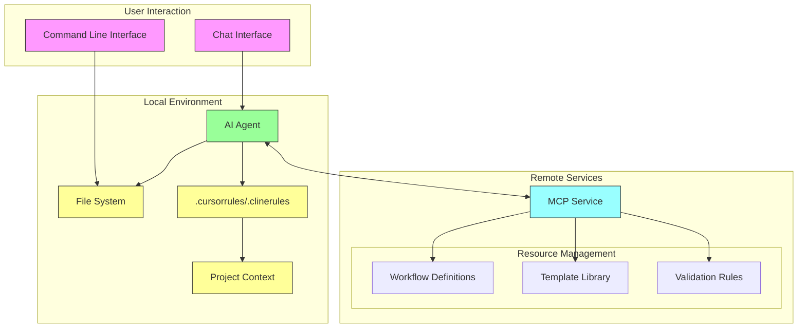
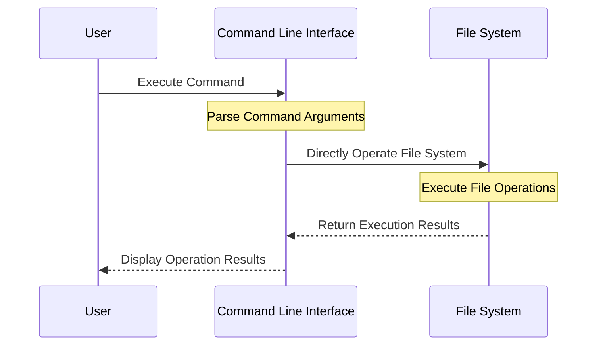
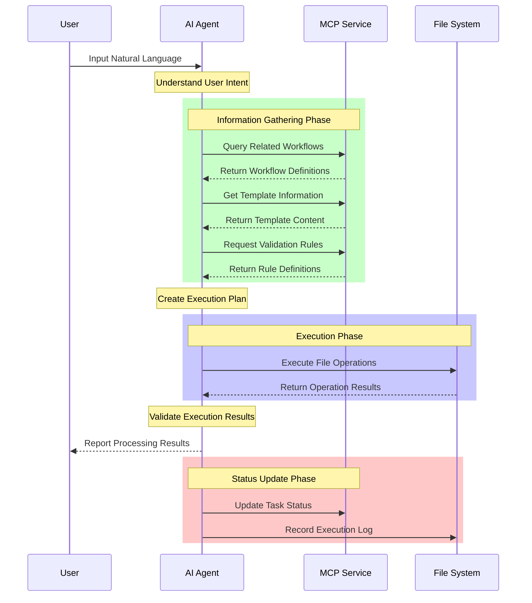

# Dot AI Architecture Design and Implementation Roadmap

> **Note**: This document describes the planned system architecture. The MCP server component is currently under development (see issue #2) and has not yet been implemented. The current architecture diagram and process flow demonstrate the target design of the system.

## Design Principles

### 1. Dual Interaction Mode

The system supports two independent interaction methods:

1. **Command Line Mode**
   - Direct operation through CLI tools
   - Provides precise command control
   - Supports automation scripts

2. **Natural Language Mode**
   - Understands intent through MCP service
   - Provides intelligent interaction
   - Supports flexible task expression

### 2. Independent Operation Principle

CLI and MCP run completely independently, ensuring consistency through the file system:

```
.ai/
├── config/           # Framework configuration
├── templates/        # Template files
├── workspace/        # Workspace
└── state.json       # State records
```

Advantages:
- Conforms to Unix philosophy
- Simple and reliable architecture
- Easy to understand and maintain
- Avoids complex coordination mechanisms

### 3. File System Consistency

- Uses file locks to avoid conflicts
- Ensures atomic operations
- Records operation logs
- Performs periodic consistency checks

## Overall System Architecture

### 1. System Components



### 2. Interaction Flow

#### CLI Mode


#### AI-Driven Mode


### 3. AI Rules and Context Management

1. **Rule File Generation**
   ```markdown
   # Collect Information via init Command
   - Basic project information
   - Architecture and design patterns
   - Security and performance requirements
   - Workflow definitions
   
   # Generate Rule Files
   .cursorrules:        # Cursor AI rules
   .clinerules:         # Cline AI rules
   .copilot:           # GitHub Copilot configuration
   ```

2. **Rule File Content**
   ```markdown
   # Typical Rule File Structure
   - Project context description
   - Architecture and design specifications
   - Security and performance requirements
   - Workflow guidelines
   - Documentation reference rules
   ```

3. **Context Reference Mechanism**
   ```
   .ai/
   ├── 0-ai-config/          # AI configuration directory
   │   ├── .cursorrules     # Points to project documentation
   │   └── workflow.md      # Defines workflow
   ├── 1-context/           # Project context
   │   └── project_context.md
   └── 2-technical-design/  # Technical design
       └── architecture.md
   ```

   Working principle:
   1. AI reads rules file
   2. Rules file points to relevant documents
   3. AI tools follow document specifications
   4. Maintains project consistency

4. **Rules Update Mechanism**
   ```markdown
   # Manual Update
   - Modify rule file content
   - Adjust document reference relationships
   - Update workflow definitions

   # Automatic Update
   - dotai init reconfiguration
   - When project structure changes
   - When adding new features or components
   ```

This mechanism ensures that AI tools can:
- Understand the complete project context
- Follow established standards and processes
- Maintain consistency between code and documentation
- Adapt to project evolution and changes

1. **Standard Directory Structure**
   ```
   .ai/
   ├── 0-ai-config/          # AI tool configuration
   │   ├── workflow.md       # Workflow definitions
   │   ├── .cursorrules     # Cursor AI rules
   │   ├── .clinerules      # Cline AI rules
   │   └── mcp.md           # MCP configuration
   ├── 1-context/           # Project context
   │   ├── project_context.md
   │   └── project_conventions.md
   ├── 2-technical-design/  # Technical design
   └── workspace/           # Workspace
   ```

2. **Context Transfer Mechanism**
   - .cursorrules/.clinerules define AI tool behavior rules
   - AI tools obtain project configuration and context through rules
   - MCP service manages workflows and template resources
   - Each AI interaction is based on complete project context

3. **Component Interaction**
   ```mermaid
   graph LR
     AI[AI Tools] --> |Read Rules| R[.cursorrules/.clinerules]
     R --> |Point to| C[Project Context]
     AI --> |Request Resources| M[MCP Service]
     M --> |Provide| W[Workflows/Templates]
   ```

4. **File System Structure**
   ```
   .ai/
   ├── config/           # Configuration files
   │   ├── rules/       # Validation rules
   │   └── templates/   # File templates
   ├── workspace/       # Workspace
   │   ├── tasks/       # Task records
   │   └── temp/        # Temporary files
   └── state.json       # Runtime state
   ```

## Usage Examples

### 1. Command Line Mode

Using CLI for direct operations:

```bash
# Initialize project
dotai init --template typescript-next

# Add API documentation template
dotai add template api-doc

# Validate project structure
dotai validate --strict
```

### 2. Natural Language Mode

Interacting through MCP service:

```
User: "Initialize project with TypeScript template"
MCP: "I will create a project using the typescript-next template..."
[Initialization executed]
MCP: "Project creation completed, including:
     1. TypeScript configuration
     2. Basic directory structure
     3. Next.js related settings"

User: "Check if the project meets the standards"
MCP: "I'll verify the project structure..."
[Validation executed]
MCP: "Validation complete, all checks passed"
```

### 3. File Structure Example

```diff
# Project structure after initialization
.ai/
├── 0-ai-config/
│   ├── .cursorrules
│   └── workflow.md
├── 1-context/
│   └── project_context.md
└── 2-technical-design/
    └── architecture.md
```

This example shows how to achieve the same document synchronization functionality through different methods. Users can choose the appropriate interaction method based on specific scenarios.

## Current Implementation Status

1. **Implemented Components**
   - dotai CLI tool basic framework
   - Command-line argument parsing
   - Workspace management
   - File system operations

2. **Components Under Development**
   - MCP server (issue #2)
     * Validation rule engine
     * Context management system
     * AI communication interface
   - AI service integration
     * Analysis engine
     * Suggestion generation system

3. **Planned Features**
   - Distributed MCP service
   - Advanced validation rules
   - Real-time synchronization support

Before the MCP server is completed, the system runs in local mode, performing only basic file operations and document management functions. Complete AI assistance features will be released after the MCP server development is completed.