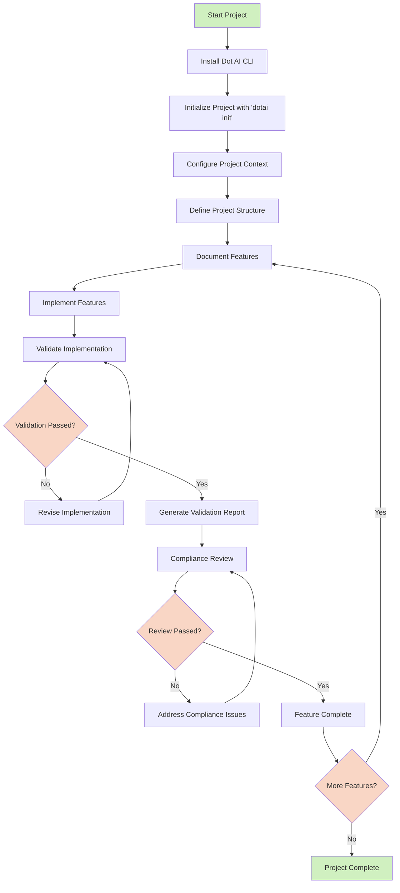

# Dot AI Framework Usage Guide

This guide provides a visual overview of how to use the Dot AI framework for AI-enhanced development projects.

## Framework Usage Workflow



## Step-by-Step Guide

### 1. Project Initialization

1. **Install Dot AI CLI**:
   ```bash
   git clone git@github.com:andrewhopper/dotai.git
   cd dotai
   npm install
   npm install -g .
   ```

2. **Initialize Your Project**:
   ```bash
   cd your-project-directory
   dotai init
   ```
   This will create a `.ai` directory structure with necessary template files.

3. **Configure Project Context**:
   - Complete the files in `.ai/docs/1-context/` folder:
     - `project_context.md`: Define project goals and requirements
     - `project_conventions.md`: Set coding standards
     - `target-users.md`: Identify user personas

### 2. Feature Development Cycle

1. **Document Feature**:
   - Create feature specification in `.ai/docs/2-technical-design/features/[feature-name]/specification.md`
   - Include requirements, acceptance criteria, and implementation details

2. **Implement Feature**:
   - Use AI tools (Cursor, Cline, etc.) that reference your `.ai` context
   - Follow the specifications defined in your documentation

3. **Validate Implementation**:
   ```bash
   dotai validate [feature-name]
   ```
   - Validates implementation against defined standards and requirements
   - Generates validation results

4. **Review and Revise**:
   - Address any validation issues
   - Update documentation if requirements change

5. **Generate Compliance Report**:
   - Create validation report in `.ai/docs/4-acceptance/compliance_reports/`
   - Document validation results and compliance status

### 3. Framework Benefits

- **Consistent Context Management**: Standardized structure for AI context
- **Self-Documenting Projects**: Documentation is integrated with development
- **Quality Assurance**: Built-in validation against project standards
- **AI Tool Compatibility**: Works with various AI coding tools
- **Improved Collaboration**: Shared understanding between developers and AI tools

## Integration with Development Workflow

The Dot AI framework integrates with your existing development workflow by:

1. **Pre-Development**:
   - Context definition
   - Structure setup
   - Documentation frameworks

2. **During Development**:
   - Context-aware AI assistance
   - Standards enforcement
   - Documentation updates

3. **Post-Development**:
   - Validation
   - Compliance reporting
   - Knowledge preservation

## Tips for Effective Usage

1. **Complete Documentation First**:
   - Take time to fully define context before implementation
   - Include business rules and technical constraints

2. **Update Documentation Regularly**:
   - Keep documentation in sync with code changes
   - Update context as requirements evolve

3. **Use Validation Actively**:
   - Run validation early and often
   - Use validation reports to guide development

4. **Customize Templates**:
   - Adapt templates to your project's specific needs
   - Add specialized sections for your domain

For detailed information on template usage, see the [Template Documentation](template-documentation.md).