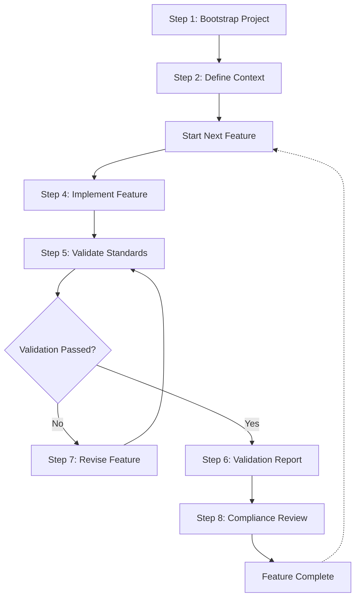

**WARNING: This is a work in progress prototype**

## Dot AI is draft standard for creating and managing context in AI coding projects.

Dot AI provides a tool-agnostic way to create and manage context when coding AI projects. It establishes a standardized structure for project documentation, development workflows, and validation processes, enabling more effective collaboration between developers and AI tools.

The framework includes a structured development workflow that guides projects from initialization through feature development and validation, ensuring consistent quality and comprehensive documentation.

## Goals

1. Provide context to accelerate project velocity while maintaining software quality.
2. Solve for cases where AI re-implements basic features like auth or middlware.
3. Solve for cases where AI uses the wrong commands due to outdated documentation (e.g. shadcn-ui vs. shadcn@ or NextJS App Router).
4. Create a self documenting, self correcting systems which clear and testable acceptance and validation criteria.

## Workflow Overview



This workflow ensures that all features are properly documented, implemented according to standards, and validated before being considered complete. Each step includes preflight and post-flight hooks that automate validation against established facts and standards.

## How can I use this?

Fill out your project details in the various folders.  Drop the .cursorrules/.clinerules prompts into your system project, root dir, or settings.  Then Cursor/Cline will refer to these requirements and automatically document your project.

# CLI Installation

```
git clone git@github.com:andrewhopper/dotai.git
cd dotai
npm install
npm install -g . (install the CLI globally)
```

# CLI Usage
```
switch to your project dir
cd ~/dev/proj1
dotai init
```

## Directory Structure

The `.ai` directory serves as a standardized location for AI-related context, documentation, and resources. This structure helps maintain consistent organization across projects and enables AI tools to easily locate and utilize project context.

```
.ai/
└── docs/
    ├── 0-ai-config/                # AI tool configuration
    │   ├── workflow.md             # Development workflow 
    │   ├── mcp.md                  # Model Context Protocol configuration
    │   ├── .cursorrules            # Cursor AI rules
    │   └── .clinerules             # Cline AI rules
    ├── 1-context/                  # Project context documentation
    │   ├── project_context.md      # Project scope and goals
    │   ├── project_conventions.md  # Project-specific conventions
    │   ├── target-personas/        # Target user documentation
    │   └── standards/              # Applicable standards
    ├── 2-technical-design/         # Technical design documentation
    │   ├── development_workflow/   # Development process documentation
    │   │   └── workflow.md         # Standardized workflow with Mermaid diagram
    │   ├── requirements/           # Project requirements
    │   │   └── security/           # Security requirements
    │   │       └── ssl_requirements.md # SSL implementation requirements
    │   └── features/               # Feature specifications
    │       └── [feature-name]/     # Individual feature documentation
    │           └── specification.md # Feature specification
    ├── 3-development/              # Development documentation
    │   ├── folder-locks.md         # Folder lock documentation
    │   └── tasklog/                # AI assistance documentation
    └── 4-acceptance/               # Acceptance and validation
        └── compliance_reports/     # Compliance and validation reports
            └── security/           # Security compliance reports
                └── 2025-03-13_ssl.md # SSL implementation validation
```

## Research

See the following research documents for more information:

- [Coding Workflows](research/coding-workflows.md) - Research on Cursor rules and Cline best practices
- [MCP Research](research/mcp-servers.md) - Research on Model Context Protocol implementation and best practices


## License

This project is licensed under the MIT License - see the [LICENSE](LICENSE) file for details.

## Roadmap

- Create NPM CLI to configure repos for AI
- Create MCP server to manage and maintain context
- Create NPM CLI that will walk users through configuring their apps
- Create implementation plans for each feature with an impact/risk metrics and then adjust levels of human guidance based on the expected risk associated with a set of proposed changes.

## Creator

Andrew Hopper  
[Twitter/X](https://x.com/andrewhopper)  
[LinkedIn](https://linkedin.com/in/andrewhopper)
