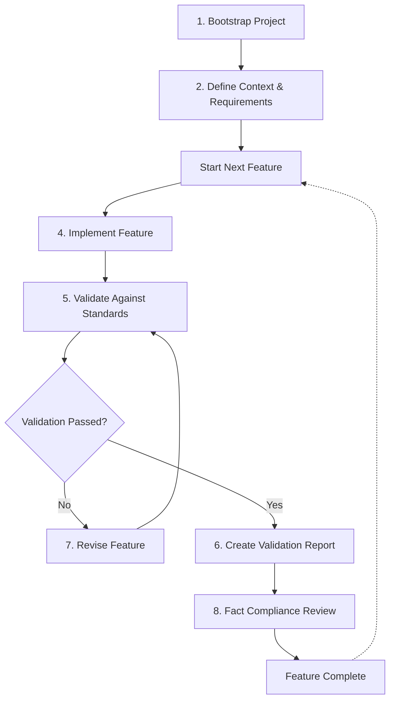

**WARNING: This is a work in progress prototype**

## Dot AI is draft standard for creating and managing context in AI coding projects.

Dot AI provides a tool-agnostic way to create and manage context when coding AI projects. It establishes a standardized structure for project documentation, development workflows, and validation processes, enabling more effective collaboration between developers and AI tools.

The framework includes a structured development workflow that guides projects from initialization through feature development and validation, ensuring consistent quality and comprehensive documentation.

## Workflow Overview



This workflow ensures that all features are properly documented, implemented according to standards, and validated before being considered complete. Each step includes preflight and post-flight hooks that automate validation against established facts and standards.

## Directory Structure

The `.ai` directory serves as a standardized location for AI-related context, documentation, and resources. This structure helps maintain consistent organization across projects and enables AI tools to easily locate and utilize project context.

```
.ai/
└── docs/
    ├── 0-ai-config/                # AI tool configuration
    │   ├── workflow.md             # Development workflow 
    │   ├── mcp.md                  # Model Context Protocol configuration
    │   ├── .cursorrules            # Cursor AI rules
    │   └── .clinerules             # Cline AI rules
    ├── 1-context/                  # Project context documentation
    │   ├── project_context.md      # Project scope and goals
    │   ├── project_conventions.md  # Project-specific conventions
    │   ├── target-personas/        # Target user documentation
    │   └── standards/              # Applicable standards
    ├── 2-technical-design/         # Technical design documentation
    │   ├── development_workflow/   # Development process documentation
    │   │   └── workflow.md         # Standardized workflow with Mermaid diagram
    │   ├── requirements/           # Project requirements
    │   │   └── security/           # Security requirements
    │   │       └── ssl_requirements.md # SSL implementation requirements
    │   └── features/               # Feature specifications
    │       └── [feature-name]/     # Individual feature documentation
    │           └── specification.md # Feature specification
    ├── 3-development/              # Development documentation
    │   ├── folder-locks.md         # Folder lock documentation
    │   └── tasklog/                # AI assistance documentation
    └── 4-acceptence/               # Acceptance and validation
        └── compliance_reports/     # Compliance and validation reports
            └── security/           # Security compliance reports
                └── 2025-03-13_ssl.md # SSL implementation validation
```

### Key Components

#### docs/0-ai-config/
Contains configuration files for AI tools, including workflow documentation, Model Context Protocol settings, and rules for specific AI assistants like Cursor and Cline.

#### docs/1-context/
Houses project context documentation, including project scope, conventions, target personas, and applicable standards.

##### docs/1-context/project_context.md
Documents the project's scope, goals, and context to provide AI tools with the necessary background information.

##### docs/1-context/project_conventions.md
Defines project-specific conventions, coding standards, and practices to ensure consistency.

##### docs/1-context/target-personas/
Contains documentation about the target users or personas for the project, helping to guide design and development decisions.

##### docs/1-context/standards/
Houses documentation on applicable standards, best practices, and requirements that the project must adhere to.

#### docs/2-technical-design/
Contains technical design documentation, including development workflows, project requirements, and feature specifications.

##### docs/2-technical-design/development_workflow/
Documents the standardized development process and workflow for projects using the Dot AI framework. This includes step-by-step guides, best practices, and workflow diagrams to ensure consistent development practices.

##### docs/2-technical-design/requirements/
Stores detailed requirements for various aspects of the project, organized by category (e.g., security, performance, accessibility).

##### docs/2-technical-design/features/
Stores feature specifications, organized by feature name. Each feature has its own directory containing detailed documentation.

#### docs/3-development/
Contains documentation related to the development process, including folder lock documentation and AI assistance logs.

##### docs/3-development/folder-locks.md
Specifies which folders should not be modified by AI tools, ensuring critical parts of the codebase remain under human control.

##### docs/3-development/tasklog/
Records AI assistance activities, providing a history of AI interactions and decisions made during development.

#### docs/4-acceptence/
Houses acceptance criteria, validation reports, and compliance documentation.

##### docs/4-acceptence/compliance_reports/
Contains validation, compliance, and stability reports generated during project evaluation runs. These reports serve as evidence of the project's adherence to standards and requirements.

## License

This project is licensed under the MIT License - see the [LICENSE](LICENSE) file for details.

## Roadmap

* Create NPM CLI to configure repos for AI
* Create MCP server to manage and maintain context

## Creator

Andrew Hopper
x.com/andrewhopper
linkedin.com/in/andrewhopper
