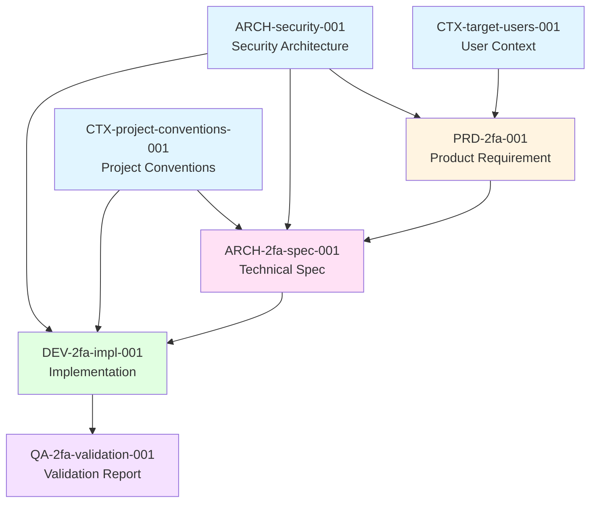

# Provenance Tracking Example

This document demonstrates how provenance/lineage tracking works in practice with a complete example feature implementation chain.

## Example Feature: Two-Factor Authentication (2FA)

This example shows the complete document chain from user requirement through validation, with full provenance metadata.

---

## Document 1: Product Requirement

**File**: `3-development/product/prd-2fa-001.md`

```yaml
---
id: PRD-2fa-001
created: 2025-03-10
authors:
  - name: "Sarah Johnson"
    email: "sarah@example.com"
    role: "Product Manager"
provenance:
  depends_on:
    - id: CTX-target-users-001
      type: context
      relationship: addresses
      sections: [USER-001, USER-002]
      reason: "Addresses security concerns of enterprise users"
    - id: ARCH-security-001
      type: architecture
      relationship: follows
      sections: [REQ-002]
      reason: "Must comply with existing security architecture"
  generates:
    - id: ARCH-2fa-spec-001
      type: specification
      relationship: specifies
---

# Two-Factor Authentication Requirements <!-- STORY-001 -->

## Overview <!-- INFO-001 -->
Implement two-factor authentication to enhance account security for enterprise users.

## User Stories <!-- STORY-002 -->
- As an enterprise user, I want to enable 2FA on my account so that my data is more secure
- As a user, I want to use an authenticator app (Google Authenticator, Authy) for 2FA codes
- As a user, I want backup codes in case I lose access to my authenticator app

## Acceptance Criteria <!-- TEST-001 -->
- Users can enable/disable 2FA in account settings
- System generates QR code for authenticator app setup
- System validates 6-digit TOTP codes
- System provides 10 backup codes upon 2FA setup
- Users are prompted for 2FA code after password login
```

---

## Document 2: Technical Specification

**File**: `2-technical-design/features/2fa/specification.md`

```yaml
---
id: ARCH-2fa-spec-001
created: 2025-03-12
authors:
  - name: "Mike Chen"
    email: "mike@example.com"
    role: "Solutions Architect"
provenance:
  derived_from:
    - id: PRD-2fa-001
      type: product-requirement
      relationship: implements
      sections: [STORY-001, STORY-002, TEST-001]
      reason: "Technical specification derived from product requirements"
  depends_on:
    - id: ARCH-security-001
      type: architecture
      relationship: follows
      sections: [REQ-001, REQ-002, REQ-003]
      reason: "Follows security architecture patterns for auth"
    - id: CTX-project-conventions-001
      type: convention
      relationship: adheres-to
      reason: "Follows project coding and documentation standards"
  generates:
    - id: DEV-2fa-impl-001
      type: implementation
      relationship: implements-spec
---

# Two-Factor Authentication Technical Specification <!-- SPEC-001 -->

## Architecture <!-- SPEC-002 -->

### Technology Stack
- **TOTP Algorithm**: RFC 6238 Time-Based One-Time Password
- **Library**: `speakeasy` for TOTP generation/validation
- **QR Code**: `qrcode` library for QR code generation
- **Backup Codes**: Cryptographically secure random strings

### Database Schema
\`\`\`sql
CREATE TABLE user_2fa (
  user_id UUID PRIMARY KEY,
  secret TEXT NOT NULL,
  enabled BOOLEAN DEFAULT FALSE,
  backup_codes TEXT[] NOT NULL,
  created_at TIMESTAMP DEFAULT NOW(),
  last_used_at TIMESTAMP
);
\`\`\`

## API Endpoints <!-- SPEC-003 -->

### POST /api/user/2fa/setup
Generate 2FA secret and QR code

### POST /api/user/2fa/enable
Enable 2FA after verifying initial code

### POST /api/user/2fa/disable
Disable 2FA after password verification

### POST /api/auth/verify-2fa
Verify 2FA code during login

## Security Requirements <!-- REQ-001 -->
- Secret keys must be encrypted at rest
- Rate limiting: 5 attempts per 5 minutes
- Backup codes can only be used once
- 30-second time window for TOTP codes
```

---

## Document 3: Implementation

**File**: `3-development/implementation/dev-2fa-impl-001.md`

```yaml
---
id: DEV-2fa-impl-001
created: 2025-03-15
authors:
  - name: "Alex Rodriguez"
    email: "alex@example.com"
    role: "Senior Developer"
provenance:
  derived_from:
    - id: ARCH-2fa-spec-001
      type: specification
      relationship: implements
      sections: [SPEC-001, SPEC-002, SPEC-003, REQ-001]
      reason: "Implements the 2FA technical specification"
  depends_on:
    - id: CTX-project-conventions-001
      type: convention
      relationship: adheres-to
      reason: "Follows project coding standards"
    - id: ARCH-security-001
      type: architecture
      relationship: follows
      sections: [REQ-001, REQ-003]
      reason: "Follows security architecture for encryption and auth"
  generates:
    - id: QA-2fa-validation-001
      type: validation
      relationship: validates
---

# Two-Factor Authentication Implementation <!-- IMPL-001 -->

## Implementation Details <!-- IMPL-002 -->

### Files Created/Modified
- `src/api/auth/2fa-setup.ts` - Setup endpoint
- `src/api/auth/2fa-verify.ts` - Verification endpoint
- `src/services/totp.service.ts` - TOTP generation/validation
- `src/middleware/2fa.middleware.ts` - 2FA check middleware
- `src/database/migrations/20250315_add_2fa.sql` - Database migration

### Code Structure <!-- IMPL-003 -->

\`\`\`typescript
// src/services/totp.service.ts
export class TOTPService {
  generateSecret(): string
  generateQRCode(username: string, secret: string): Promise<string>
  verifyToken(secret: string, token: string): boolean
  generateBackupCodes(): string[]
}
\`\`\`

## Testing Strategy <!-- TEST-001 -->
- Unit tests for TOTP generation/validation
- Integration tests for API endpoints
- E2E tests for complete 2FA flow
- Security tests for rate limiting and encryption

## Code References <!-- TASK-001 -->
- Main implementation: `src/api/auth/2fa-setup.ts:1-150`
- TOTP service: `src/services/totp.service.ts:1-200`
- Database migration: `src/database/migrations/20250315_add_2fa.sql:1-30`
```

---

## Document 4: Validation Report

**File**: `4-acceptance-reports/qa-2fa-validation-001.md`

```yaml
---
id: QA-2fa-validation-001
created: 2025-03-18
authors:
  - name: "Emma Wilson"
    email: "emma@example.com"
    role: "QA Engineer"
provenance:
  derived_from:
    - id: DEV-2fa-impl-001
      type: implementation
      relationship: validates
      reason: "Validates the 2FA implementation"
  validates:
    - id: ARCH-2fa-spec-001
      type: specification
      relationship: confirms-compliance
      sections: [SPEC-001, SPEC-002, SPEC-003, REQ-001]
      reason: "Confirms implementation meets all specifications"
    - id: PRD-2fa-001
      type: product-requirement
      relationship: confirms-requirements
      sections: [STORY-001, STORY-002, TEST-001]
      reason: "Confirms all user stories and acceptance criteria are met"
test_date: 2025-03-18
---

# Two-Factor Authentication Validation Report <!-- TEST-001 -->

## Test Summary <!-- TEST-002 -->
Comprehensive validation of 2FA implementation including functional, security, and usability testing.

## Test Environment <!-- TEST-003 -->
- **Environment**: Staging
- **Browser**: Chrome 122, Firefox 123, Safari 17
- **Mobile**: iOS 17.3, Android 14
- **Version**: v2.5.0-rc1

## Test Results <!-- TEST-004 -->

| Requirement ID | Status | Notes |
|---------------|--------|-------|
| PRD-2fa-001:STORY-001 | ✅ PASS | Users can enable/disable 2FA successfully |
| PRD-2fa-001:STORY-002 | ✅ PASS | Google Authenticator and Authy tested and working |
| PRD-2fa-001:STORY-002 | ✅ PASS | Backup codes generated and validated correctly |
| PRD-2fa-001:TEST-001 | ✅ PASS | All acceptance criteria met |
| ARCH-2fa-spec-001:SPEC-002 | ✅ PASS | Database schema implemented correctly |
| ARCH-2fa-spec-001:SPEC-003 | ✅ PASS | All API endpoints working as specified |
| ARCH-2fa-spec-001:REQ-001 | ✅ PASS | Security requirements validated |
| DEV-2fa-impl-001:IMPL-001 | ✅ PASS | Implementation complete and functional |

## Security Testing <!-- TEST-005 -->

### Rate Limiting
- ✅ PASS: Rate limiting enforced (5 attempts per 5 minutes)
- ✅ PASS: Rate limit counter resets correctly

### Encryption
- ✅ PASS: Secrets encrypted at rest using AES-256
- ✅ PASS: Backup codes encrypted properly

### TOTP Validation
- ✅ PASS: Time window validation working (30-second window)
- ✅ PASS: Clock skew tolerance working correctly
- ✅ PASS: Backup codes single-use enforced

## Issues Found <!-- BUG-001 -->
None - all tests passed

## Recommendations <!-- INFO-001 -->
1. Consider adding biometric fallback for mobile apps
2. Add analytics for 2FA adoption rate
3. Implement SMS backup option for users without smartphones

## Conclusion <!-- INFO-002 -->
✅ **APPROVED FOR PRODUCTION**

All requirements, specifications, and implementation details have been validated. The 2FA feature is ready for production deployment.

## Provenance Validation <!-- VAL-001 -->

Complete provenance chain verified:

\`\`\`
PRD-2fa-001 (Product Requirement)
    ↓ derived_from
ARCH-2fa-spec-001 (Technical Specification)
    ↓ implements
DEV-2fa-impl-001 (Implementation)
    ↓ validates
QA-2fa-validation-001 (This Report)
\`\`\`

All documents properly linked with provenance metadata. No gaps in traceability.
```

---

## Visual Representation of Provenance Chain



## Benefits Demonstrated

1. **Complete Traceability**: Can trace from user need → requirement → spec → implementation → validation
2. **Impact Analysis**: If `ARCH-security-001` changes, we know it affects both the spec and implementation
3. **Compliance**: QA report validates against both spec and original requirements
4. **Knowledge Transfer**: New team members can understand the entire feature evolution
5. **Gap Detection**: Missing links in provenance chain would be immediately visible

## Query Examples

### Find all documents derived from PRD-2fa-001
```bash
grep -r "derived_from.*PRD-2fa-001" .ai/docs/
```

### Find what PRD-2fa-001 generates
```bash
grep -A 5 "^id: PRD-2fa-001" .ai/docs/ | grep -A 3 "generates:"
```

### Validate complete chain
```bash
# Check each link in the chain
echo "PRD-2fa-001 generates ARCH-2fa-spec-001"
echo "ARCH-2fa-spec-001 generates DEV-2fa-impl-001"
echo "DEV-2fa-impl-001 generates QA-2fa-validation-001"
```
