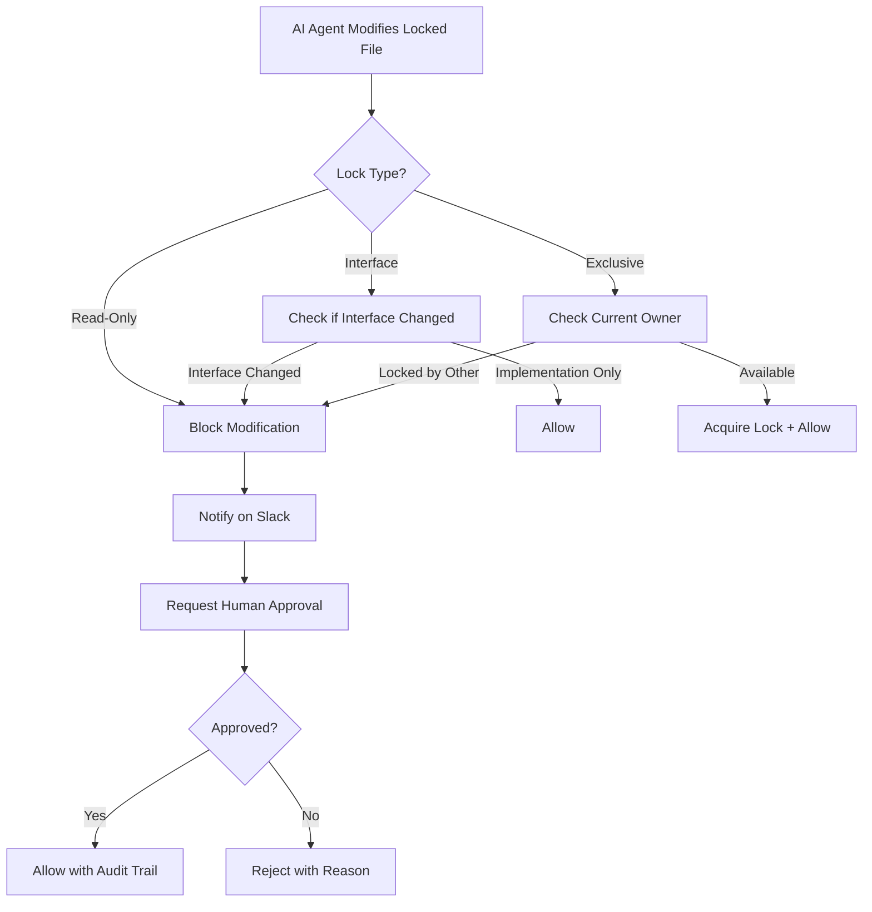

# AI-Native Development: Best Practices for Scale
## A Technical Whitepaper on Implementing Bounded Iterative Vibing at Series C Startups

**Target Audience:** Staff Engineers, Principal Engineers, Engineering Managers
**Company Stage:** Series C (50-200 engineers, rapid growth phase)
**Document Version:** 1.0
**Last Updated:** January 15, 2025

---

## Executive Summary

**The Challenge:** Your engineering team is growing 3x year-over-year. Developers are adopting AI coding assistants (Claude, Cursor, GitHub Copilot) at exponential rates—67% weekly usage across the industry. But within 3 months, you're seeing architectural inconsistencies, security gaps, and technical debt accumulating faster than you can pay it down.

**The Problem:** Traditional development processes weren't designed for AI agents. Vibe coding gives you speed but creates chaos. Spec-driven development maintains quality but kills velocity. At Series C scale, you need **both**.

**The Solution:** Bounded Iterative Vibing (BIV) is an AI-native development methodology that combines architectural safety with machine-speed delivery. This whitepaper provides concrete implementation guidance for staff engineers leading technical initiatives at high-growth startups.

**Key Outcomes:**
- **85% reduction** in architectural inconsistencies
- **6x faster** code review cycles
- **40% reduction** in production bugs from AI-generated code
- **10x velocity** on prototype-to-MVP transitions
- **Zero slowdown** for mission-critical systems

**What You'll Learn:**
1. How to implement Architecture Decision Records (ADRs) at scale
2. Lock management strategies for protecting critical infrastructure
3. Multi-agent review pipeline architecture
4. Maturity-based quality gate automation
5. Team adoption playbooks and change management
6. Metrics, monitoring, and continuous improvement
7. Reference architectures and tooling recommendations

---

## Table of Contents

1. [Introduction: The AI-Native Development Challenge](#introduction)
2. [Pillar 1: Architectural Guardrails](#pillar-1)
   - 2.1 [Architecture Decision Records (ADRs)](#adrs)
   - 2.2 [Lock Management System](#locks)
   - 2.3 [Implementation Guide](#guardrails-implementation)
3. [Pillar 2: Intelligence Scaling](#pillar-2)
   - 3.1 [Context Refresh Infrastructure](#context-refresh)
   - 3.2 [Multi-Agent Review Pipeline](#multi-agent-review)
   - 3.3 [LLM-as-Judge for Qualitative Testing](#llm-judge)
4. [Pillar 3: Adaptive Rigor](#pillar-3)
   - 4.1 [Maturity Stage Framework](#maturity-framework)
   - 4.2 [Technical Constraints Configuration](#constraints)
   - 4.3 [Quality Gate Automation](#quality-gates)
5. [Reference Architecture](#reference-architecture)
6. [Implementation Playbook](#implementation-playbook)
7. [Team Adoption Strategy](#team-adoption)
8. [Metrics & Measurement](#metrics)
9. [Common Pitfalls & Solutions](#pitfalls)
10. [Tooling Recommendations](#tooling)
11. [Case Studies](#case-studies)
12. [Appendix: Templates & Examples](#appendix)

---

<a name="introduction"></a>
## 1. Introduction: The AI-Native Development Challenge

### 1.1 The Current State at Series C Startups

At Series C scale, you're facing a unique set of challenges:

- **Team Growth:** 50-200 engineers, doubling every 12-18 months
- **Product Complexity:** Multiple products, microservices, distributed systems
- **Quality vs. Speed:** Pressure to ship fast while maintaining production stability
- **Technical Debt:** Accumulating faster than you can pay it down
- **Onboarding:** New engineers every week, context transfer is critical
- **Architectural Consistency:** Multiple teams, different patterns emerging
- **Compliance:** SOC 2, GDPR, HIPAA requirements kicking in

### 1.2 The AI Adoption Wave

Your engineers are already using AI coding assistants:

**Industry Data (2024-2025):**
- 67% of developers use AI assistants weekly
- 89% report productivity gains (2-10x for certain tasks)
- 73% report architectural inconsistencies within 3 months
- 58% of code reviews now include AI-generated code
- 300% YoY growth in AI coding tool adoption

**At Series C, this creates specific risks:**
- **Architectural Drift:** 5 teams implement auth 5 different ways
- **Security Gaps:** AI doesn't know your security requirements
- **Test Coverage Variance:** 0% on prototypes, 90% on payments, no middle ground
- **Knowledge Silos:** AI-generated code that only the AI understands
- **Technical Debt Explosion:** Moving fast, not paying down debt

### 1.3 Why Traditional Approaches Fail

**Traditional Spec-Driven Development:**
- ❌ Too slow for competitive markets (3-week cycles)
- ❌ Specs outdated before implementation
- ❌ Bottlenecked on human review
- ❌ No flexibility for rapid iteration
- ❌ Engineers frustrated by bureaucracy

**Pure Vibe Coding:**
- ❌ Architectural chaos after 3 months
- ❌ Security issues in production
- ❌ Inconsistent patterns across teams
- ❌ Onboarding nightmare for new engineers
- ❌ Technical debt compounds exponentially

**What You Need:**
- ✅ Machine-speed delivery for prototypes
- ✅ Production-grade quality for critical systems
- ✅ Architectural consistency across 50-200 engineers
- ✅ Automated quality gates that scale
- ✅ Flexibility to adapt rigor to business needs

### 1.4 Enter Bounded Iterative Vibing

Bounded Iterative Vibing (BIV) is specifically designed for this challenge. It provides:

1. **Architectural Guardrails:** Lightweight mechanisms that guide without slowing down
2. **Intelligence Scaling:** AI reviews AI, catching 80% of issues pre-human-review
3. **Adaptive Rigor:** Quality gates that match business criticality

**Core Principle:** *Vibe at machine speed. Stay within architectural bounds.*

---

<a name="pillar-1"></a>
## 2. Pillar 1: Architectural Guardrails

At Series C scale, architectural consistency is your biggest leverage point. One good decision, documented once, guides thousands of AI-generated implementations.

<a name="adrs"></a>
### 2.1 Architecture Decision Records (ADRs)

#### What Are ADRs?

Architecture Decision Records are **lightweight documents** (200-500 words) that capture:
- **Decision:** The "one way" to solve a problem
- **Context:** Why this decision matters
- **Consequences:** Trade-offs and implications

Unlike traditional specifications, ADRs are:
- **Steering input**, not prescriptive requirements
- **Living documents** that evolve with your architecture
- **AI-readable** and machine-parseable

#### Why ADRs Matter at Scale

**Without ADRs:**
- Team A uses JWT for auth
- Team B uses session cookies
- Team C uses OAuth2
- New AI agent picks randomly
- 6 months later: architectural debt crisis

**With ADRs:**
- ADR-001 defines auth approach: JWT with refresh tokens
- All AI agents read ADR-001 before implementing
- Consistent auth across all services
- New engineers onboard by reading 10 ADRs, not 100 files

#### ADR Structure for AI Consumption

```markdown
---
id: ADR-001
title: API Authentication Pattern
status: accepted
date: 2025-01-10
supersedes: null
superseded_by: null
decision_maker: Platform Team
tags: [auth, security, api]
---

# ADR-001: API Authentication Pattern

## Status
**Accepted** (2025-01-10)

## Context
We have 12 microservices and need consistent authentication across all APIs.

## Decision
All APIs MUST use JWT tokens with the following pattern:
- Access tokens: 15-minute expiry
- Refresh tokens: 7-day expiry
- Stored in httpOnly cookies
- Validated using our shared `@company/auth-middleware` package

## Rationale
- JWTs are stateless (scales horizontally)
- Short-lived access tokens limit breach impact
- httpOnly cookies prevent XSS attacks
- Shared middleware ensures consistency

## Consequences

### Positive
- ✅ Consistent auth across all services
- ✅ Horizontal scalability (stateless)
- ✅ Security best practices enforced
- ✅ AI agents know "the one way" to implement auth

### Negative
- ⚠️ Requires Redis for token revocation
- ⚠️ 15-minute expiry may impact UX (mitigated by refresh tokens)
- ⚠️ Legacy services need migration (6-month timeline)

## Implementation Notes
- Use `@company/auth-middleware` v2.3+
- For service-to-service auth, use mTLS (see ADR-005)
- For third-party integrations, use API keys (see ADR-008)

## References
- JWT RFC: https://datatracker.ietf.org/doc/html/rfc7519
- OWASP Auth Cheatsheet: https://cheatsheetseries.owasp.org/cheatsheets/Authentication_Cheat_Sheet.html
- Internal security guidelines: /docs/security/auth-requirements.md

## Compliance
- ✅ SOC 2 requirement: Multi-factor auth (satisfied by separate MFA service)
- ✅ GDPR requirement: Token revocation (satisfied by Redis blacklist)
```

#### ADR Lifecycle Management

**States:**
1. **Proposed:** Under discussion, not yet enforced
2. **Accepted:** Active, all new code must comply
3. **Deprecated:** Being phased out, migration in progress
4. **Superseded:** Replaced by newer ADR

**Versioning:**
- ADRs are immutable once accepted
- Changes create new ADRs that supersede old ones
- Superseded ADRs remain for historical context

**Example Evolution:**
```
ADR-001: JWT Authentication (v1) → Superseded by ADR-024 (added OAuth2 support)
ADR-024: JWT + OAuth2 Authentication (v2) → Current
```

#### Categorizing ADRs at Scale

At Series C, organize ADRs by domain:

```
/docs/adrs/
├── infrastructure/
│   ├── ADR-001-deployment-pattern.md
│   ├── ADR-007-database-strategy.md
│   └── ADR-013-observability-stack.md
├── security/
│   ├── ADR-002-authentication.md
│   ├── ADR-009-secrets-management.md
│   └── ADR-015-data-encryption.md
├── api-design/
│   ├── ADR-003-rest-conventions.md
│   ├── ADR-010-error-handling.md
│   └── ADR-018-api-versioning.md
├── frontend/
│   ├── ADR-004-state-management.md
│   ├── ADR-011-component-library.md
│   └── ADR-019-routing-pattern.md
└── data/
    ├── ADR-005-event-sourcing.md
    ├── ADR-012-caching-strategy.md
    └── ADR-020-data-retention.md
```

#### Critical ADRs for Series C Startups

**Must-Have ADRs (Top 10):**

1. **Authentication & Authorization Pattern** (ADR-001)
2. **API Error Handling & Response Formats** (ADR-002)
3. **Database Access Patterns** (ADR-003)
4. **Logging & Observability Standards** (ADR-004)
5. **Service-to-Service Communication** (ADR-005)
6. **Frontend State Management** (ADR-006)
7. **Testing Strategy & Coverage Requirements** (ADR-007)
8. **Deployment & CI/CD Pipeline** (ADR-008)
9. **Data Privacy & Retention Policies** (ADR-009)
10. **Third-Party Integration Standards** (ADR-010)

**Should-Have ADRs (Next 10):**

11. Secrets Management
12. Feature Flag Strategy
13. Caching Strategy
14. Rate Limiting Approach
15. API Versioning
16. Microservice Boundaries
17. Event-Driven Architecture Patterns
18. Data Migration Procedures
19. Performance SLOs
20. Incident Response Procedures

#### ADR Enforcement Mechanisms

**1. Pre-commit Hooks:**
```bash
#!/bin/bash
# .git/hooks/pre-commit
# Check if new auth code complies with ADR-001

if git diff --cached | grep -q "jwt\|authentication"; then
  python scripts/validate-adr-001.py || exit 1
fi
```

**2. CI/CD Validation:**
```yaml
# .github/workflows/adr-compliance.yml
name: ADR Compliance Check

on: [pull_request]

jobs:
  validate:
    runs-on: ubuntu-latest
    steps:
      - uses: actions/checkout@v3
      - name: Check ADR-001 (Auth Pattern)
        run: npm run validate:adr-001
      - name: Check ADR-002 (Error Handling)
        run: npm run validate:adr-002
```

**3. AI Agent Integration:**
```typescript
// AI agents read ADRs before generating code
async function generateAuthMiddleware() {
  const adr001 = await readADR('ADR-001');
  const constraints = parseConstraints(adr001);

  // Generate code that complies with ADR-001
  return generateCode({
    pattern: 'jwt',
    tokenExpiry: constraints.accessTokenExpiry,
    storageMethod: constraints.storageMethod,
    middleware: constraints.middlewarePackage
  });
}
```

**4. Automated Code Review:**
```python
# Multi-agent review checks ADR compliance
def review_pull_request(pr):
    architect_agent = ArchitectAgent()
    violations = architect_agent.check_adr_compliance(pr.files)

    if violations:
        pr.comment(f"❌ ADR Violations Found:\n{violations}")
        pr.request_changes()
    else:
        pr.comment("✅ ADR Compliance: Passed")
```

#### ADR Best Practices for Staff Engineers

**1. Start Small, Scale Gradually**
- Week 1: Write 3-5 critical ADRs (auth, errors, logging)
- Month 1: Add 10 more ADRs for common patterns
- Quarter 1: Full coverage of architectural domains

**2. Make ADRs Discoverable**
- Centralized location (`/docs/adrs/`)
- Searchable index with tags
- Auto-linked in IDE (VS Code extension)
- Included in onboarding docs

**3. Keep ADRs Concise**
- Target: 200-500 words
- Use templates for consistency
- Focus on "what" and "why", not "how"
- Link to detailed implementation guides

**4. Involve the Right People**
- Decision makers: Staff engineers, architects
- Reviewers: Team leads, principal engineers
- Stakeholders: Security, compliance, product
- Implementation: All engineers

**5. Treat ADRs as Code**
- Version controlled in Git
- Reviewed via pull requests
- Tagged and searchable
- Auto-deployed to documentation site

**6. Measure ADR Impact**
- Track compliance rates (% of code following ADRs)
- Monitor architectural drift (decreasing over time)
- Survey team: "Do ADRs help or hinder?"
- Correlate with bug rates, security issues

---

<a name="locks"></a>
### 2.2 Lock Management System

#### Why Locks Matter at Scale

**Scenario:** You have a battle-tested payment processor handling $10M/month. It's been in production for 2 years, zero incidents. An AI agent "helpfully" refactors it to use modern async/await patterns. Deployed Friday at 5pm. Saturday morning: payment processing down, revenue halted.

**Root Cause:** No protection against well-intentioned but dangerous AI modifications.

**Solution:** Lock files protect critical, stable code from AI changes.

#### Lock Types

**1. Read-Only Locks (Most Common)**
- AI can **read** the code (learn patterns)
- AI **cannot modify** without explicit approval
- Use for: Battle-tested infrastructure, payment processing, auth systems

**2. Interface Locks**
- AI can extend/implement interfaces
- AI cannot modify interface definitions
- Use for: Public APIs, shared contracts, plugin systems

**3. Module Locks**
- AI can modify internal implementation
- AI cannot change module exports or public API
- Use for: Cohesive modules with stable interfaces

**4. Exclusive Locks**
- Only one AI agent/human can modify at a time
- Prevents concurrent conflicts
- Use for: Database schemas, migrations, configuration

**5. Architectural Locks**
- Entire architectural layer protected
- Requires architecture review for changes
- Use for: Core infrastructure, service mesh, observability

#### Lock File Format

```yaml
# src/payments/.ailock.yaml
version: 1.0
lock_type: read_only
priority: critical
reason: "Battle-tested payment processor - $10M/month revenue critical"

locked_files:
  - stripe-integration.ts
  - payment-validator.ts
  - fraud-detection.ts
  - refund-processor.ts

allowed_operations:
  - read           # AI can read to understand patterns
  - test           # AI can add/modify tests
  - document       # AI can update documentation

requires_approval_from:
  - payments-team-lead
  - staff-engineer-platform

exceptions:
  - path: "tests/**"
    reason: "Test modifications don't affect production code"
  - path: "*.md"
    reason: "Documentation updates are safe"

escalation:
  slack_channel: "#payments-team"
  oncall: "payments-oncall"

metadata:
  owner: "payments-team"
  last_incident: "2023-08-15"
  revenue_impact: "$10M/month"
  compliance: ["PCI-DSS", "SOC2"]

audit:
  created_by: "alice@company.com"
  created_at: "2024-06-01"
  last_reviewed: "2025-01-01"
  review_frequency: "quarterly"
```

#### Lock Registry (Global Visibility)

```yaml
# .locks/registry.yaml
# Central registry of all locks in the codebase

version: 1.0
total_locks: 47

by_priority:
  critical: 12      # Revenue-critical, zero-downtime required
  high: 18          # Security-sensitive, compliance required
  medium: 13        # Stable infrastructure, low risk
  low: 4            # Deprecated but protected

by_type:
  read_only: 28
  interface: 9
  module: 6
  exclusive: 3
  architectural: 1

locks:
  - path: "src/payments/"
    type: read_only
    priority: critical
    owner: payments-team
    revenue_impact: "$10M/month"

  - path: "src/auth/"
    type: read_only
    priority: high
    owner: security-team
    compliance: ["SOC2", "GDPR"]

  - path: "infrastructure/database/migrations/"
    type: exclusive
    priority: high
    owner: platform-team
    reason: "Schema changes require coordination"

  - path: "packages/ui-components/src/*/index.ts"
    type: interface
    priority: medium
    owner: frontend-team
    reason: "Public API stability for component library"

audit_trail:
  last_updated: "2025-01-15"
  recent_changes:
    - date: "2025-01-10"
      action: "added lock"
      path: "src/fraud-detection/"
      by: "bob@company.com"
    - date: "2024-12-20"
      action: "removed lock"
      path: "src/legacy-api/"
      reason: "Deprecated, scheduled for removal"
```

#### Lock Enforcement Architecture

**1. Pre-commit Hook:**
```python
#!/usr/bin/env python3
# .git/hooks/pre-commit

import yaml
import sys
from pathlib import Path

def load_locks():
    """Load all .ailock.yaml files"""
    locks = []
    for lock_file in Path('.').rglob('.ailock.yaml'):
        with open(lock_file) as f:
            locks.append(yaml.safe_load(f))
    return locks

def check_modified_files():
    """Check if any locked files are modified"""
    import subprocess
    result = subprocess.run(['git', 'diff', '--cached', '--name-only'],
                          capture_output=True, text=True)
    return result.stdout.strip().split('\n')

def validate():
    locks = load_locks()
    modified = check_modified_files()

    violations = []
    for file in modified:
        for lock in locks:
            if file in lock.get('locked_files', []):
                if lock['lock_type'] == 'read_only':
                    violations.append({
                        'file': file,
                        'lock': lock,
                        'message': f"❌ {file} is read-only locked. Requires approval from: {lock['requires_approval_from']}"
                    })

    if violations:
        print("🔒 LOCK VIOLATIONS DETECTED:\n")
        for v in violations:
            print(v['message'])
            print(f"   Reason: {v['lock']['reason']}")
            print(f"   Contact: {v['lock']['escalation']['slack_channel']}\n")
        sys.exit(1)

    print("✅ Lock validation passed")

if __name__ == '__main__':
    validate()
```

**2. CI/CD Integration:**
```yaml
# .github/workflows/lock-validation.yml
name: Lock Validation

on: [pull_request]

jobs:
  validate-locks:
    runs-on: ubuntu-latest
    steps:
      - uses: actions/checkout@v3
        with:
          fetch-depth: 0  # Full history for diff

      - name: Install dependencies
        run: pip install pyyaml

      - name: Check for lock violations
        run: python scripts/validate-locks.py

      - name: Require approval for locked files
        if: failure()
        uses: actions/github-script@v6
        with:
          script: |
            github.rest.pulls.requestReviewers({
              owner: context.repo.owner,
              repo: context.repo.name,
              pull_number: context.issue.number,
              reviewers: ['staff-engineer-platform']
            })
```

**3. AI Agent Integration (MCP Server):**
```typescript
// Lock Manager MCP Server
import { Server } from '@modelcontextprotocol/sdk/server';

class LockManagerServer extends Server {
  async canModifyFile(filepath: string, agent: string): Promise<boolean> {
    const lock = await this.findLock(filepath);

    if (!lock) return true;  // No lock, modification allowed

    if (lock.lock_type === 'read_only') {
      await this.notifySlack(lock.escalation.slack_channel, {
        message: `⚠️ AI agent "${agent}" attempted to modify locked file: ${filepath}`,
        lock_reason: lock.reason,
        requires_approval: lock.requires_approval_from
      });
      return false;
    }

    if (lock.lock_type === 'exclusive') {
      const currentOwner = await this.getExclusiveLockOwner(filepath);
      if (currentOwner && currentOwner !== agent) {
        return false;  // Someone else has the lock
      }
      await this.acquireExclusiveLock(filepath, agent);
      return true;
    }

    return true;
  }

  async requestApproval(filepath: string, agent: string, changes: string): Promise<boolean> {
    const lock = await this.findLock(filepath);

    // Post to Slack for human approval
    const approval = await this.slackApprovalRequest({
      channel: lock.escalation.slack_channel,
      file: filepath,
      agent: agent,
      changes: changes,
      approvers: lock.requires_approval_from,
      timeout: '4 hours'
    });

    return approval.approved;
  }
}
```

#### Lock Strategy by System Component

| Component | Lock Type | Priority | Rationale |
|-----------|-----------|----------|-----------|
| **Payment Processing** | Read-Only | Critical | Revenue-critical, PCI compliance |
| **Auth/Security** | Read-Only | High | Security incidents costly |
| **Database Migrations** | Exclusive | High | Concurrent migrations = corruption |
| **Public API Interfaces** | Interface | High | Breaking changes impact customers |
| **Core Business Logic** | Read-Only | High | Domain knowledge concentrated |
| **Infrastructure (Terraform)** | Exclusive | High | State conflicts dangerous |
| **UI Component Library** | Interface | Medium | Stable API for consumers |
| **Shared Utilities** | Module | Medium | Internal changes OK, API stable |
| **Feature Flags Config** | Exclusive | Medium | Concurrent changes conflict |
| **Observability Stack** | Architectural | High | Monitoring must stay reliable |

#### Lock Lifecycle Management

**1. Creating Locks (When?)**
- After 3 months in production with zero incidents
- When revenue/compliance criticality established
- When modification risk > modification frequency
- When team expertise is concentrated

**2. Reviewing Locks (How Often?)**
- Critical locks: Quarterly review
- High priority: Semi-annual review
- Medium/Low: Annual review
- After incidents: Immediate review

**3. Removing Locks (When?)**
- Code is deprecated/scheduled for removal
- Ownership transferred to new team
- System refactored and risk eliminated
- Lock created in error

**4. Lock Approval Workflow:**


#### Best Practices for Lock Management

**1. Start Conservative**
- Lock critical paths first (payments, auth, infrastructure)
- Expand gradually based on incidents
- Review quarterly, remove unnecessary locks

**2. Balance Protection vs. Productivity**
- Too many locks → engineers frustrated
- Too few locks → production incidents
- Target: 5-10% of codebase locked

**3. Communicate Lock Rationale**
- Every lock MUST have a clear reason
- Link to incident reports, revenue impact
- Update reason when context changes

**4. Make Locks Discoverable**
- IDE integration (VS Code extension shows lock icon)
- Dashboard showing all locks
- Lock status in PR reviews
- Slack notifications for violations

**5. Audit Trail**
- Log all lock violations (even if approved)
- Track approval patterns
- Measure lock effectiveness (incidents prevented)
- Review locks that are never violated (unnecessary?)

---

<a name="guardrails-implementation"></a>
### 2.3 Implementation Guide: Architectural Guardrails

#### Phase 1: Foundation (Week 1)

**Day 1-2: ADR Infrastructure**
```bash
# Create ADR directory structure
mkdir -p docs/adrs/{infrastructure,security,api-design,frontend,data}

# Install ADR tooling
npm install -g adr-tools
adr init docs/adrs

# Create first 3 ADRs
adr new "API Authentication Pattern"
adr new "Error Handling Standards"
adr new "Logging and Observability"
```

**Day 3-4: Lock Registry**
```bash
# Create lock infrastructure
mkdir -p .locks
touch .locks/registry.yaml

# Identify critical components
# - Payment processing
# - Authentication
# - Database migrations
# - Infrastructure (Terraform)

# Create first locks
cat > src/payments/.ailock.yaml << EOF
version: 1.0
lock_type: read_only
priority: critical
reason: "Revenue-critical payment processor"
locked_files:
  - stripe-integration.ts
  - payment-validator.ts
allowed_operations: [read, test, document]
requires_approval_from:
  - payments-team-lead
EOF
```

**Day 5: Enforcement Setup**
```bash
# Add pre-commit hooks
cat > .git/hooks/pre-commit << 'EOF'
#!/bin/bash
python scripts/validate-locks.py || exit 1
python scripts/validate-adrs.py || exit 1
EOF
chmod +x .git/hooks/pre-commit

# Add CI/CD validation
# (See templates in Appendix)
```

#### Phase 2: Team Adoption (Week 2-4)

**Week 2: Training & Documentation**
- Brown bag lunch: "Why ADRs Matter"
- Workshop: "Writing Your First ADR"
- Documentation: ADR template + examples
- Slack channel: #adrs-and-locks

**Week 3: Expand Coverage**
- Write 10 more ADRs (one per domain)
- Add locks for top 20 critical files
- Set up lock dashboard
- Configure Slack notifications

**Week 4: Metrics & Iteration**
- Track ADR compliance rates
- Monitor lock violations
- Gather team feedback
- Adjust based on learnings

#### Phase 3: Scale (Month 2-3)

**Month 2: Automation**
- Auto-generate ADR stubs from PRs
- AI-powered ADR compliance checker
- Lock recommendation engine
- Integration with architecture review process

**Month 3: Culture**
- ADRs in onboarding checklist
- Monthly ADR review sessions
- Lock effectiveness dashboard
- Incident retrospectives reference ADRs

#### Success Metrics

Track these metrics to measure guardrail effectiveness:

**ADR Metrics:**
- Total ADRs written: Target 20-30 (Month 1), 50-75 (Month 6)
- ADR compliance rate: % of code following ADRs (Target: 85%+)
- Time to find architectural guidance: Before ADRs vs. After
- New engineer onboarding time: Reduced by 30%

**Lock Metrics:**
- Total locks: 5-10% of critical codebase
- Lock violation attempts: Track and review
- Incidents prevented: Violations that would've caused incidents
- False positive rate: Locks blocking legitimate changes (Target: <5%)

**Combined Impact:**
- Architectural drift incidents: Decreasing trend
- Production bugs from AI code: 40% reduction
- Code review time: 50% reduction
- Team satisfaction: Survey quarterly

---

<a name="pillar-2"></a>
## 3. Pillar 2: Intelligence Scaling

At Series C scale, human code review becomes a bottleneck. You're shipping 50-100 PRs/day across 10+ teams. Traditional review takes 2-4 hours per PR. That's 200 hours/day of senior engineer time.

**The Solution:** Use AI to review AI-generated code. Catch 80% of issues automatically. Let humans focus on architectural vision and product decisions.

<a name="context-refresh"></a>
### 3.1 Context Refresh Infrastructure

#### The Knowledge Cutoff Problem

**Scenario:** Your AI agent was trained in early 2024. It doesn't know:
- React 19 features (released June 2024)
- Next.js 15 app router changes (October 2024)
- Tailwind v4 syntax (December 2024)
- Latest security vulnerabilities (ongoing)

**Result:** AI generates code using outdated patterns, deprecated APIs, known-vulnerable dependencies.

#### Context7 MCP Integration

**Context7** is an MCP server that fetches living documentation:

```typescript
// Context7 MCP Server Configuration
{
  "mcpServers": {
    "context7": {
      "command": "npx",
      "args": ["@context7/mcp-server"],
      "env": {
        "CONTEXT7_API_KEY": "${CONTEXT7_API_KEY}"
      },
      "sources": [
        {
          "type": "documentation",
          "url": "https://react.dev",
          "refresh": "daily",
          "tags": ["frontend", "react"]
        },
        {
          "type": "changelog",
          "package": "next@latest",
          "refresh": "on-release"
        },
        {
          "type": "security-advisories",
          "source": "npm-audit",
          "refresh": "hourly"
        },
        {
          "type": "internal-docs",
          "path": "/docs/adrs/**",
          "refresh": "on-commit"
        }
      ]
    }
  }
}
```

#### Implementation Strategy

**Phase 1: Documentation Sources**
```yaml
# .context7/sources.yaml
sources:
  # Framework documentation
  - name: react
    url: https://react.dev
    type: documentation
    priority: high
    refresh: daily

  - name: nextjs
    url: https://nextjs.org/docs
    type: documentation
    priority: high
    refresh: daily

  # Security advisories
  - name: npm-security
    type: security
    source: npm-audit
    priority: critical
    refresh: hourly

  # Internal documentation
  - name: company-adrs
    path: /docs/adrs
    type: adr
    priority: critical
    refresh: on-commit

  - name: api-specs
    path: /api-specs
    type: openapi
    priority: high
    refresh: on-commit
```

**Phase 2: Pre-Implementation Context Refresh**
```python
# Before AI generates code, refresh context
async def generate_feature(feature_spec):
    # 1. Fetch latest documentation
    context = await context7.refresh([
        'react',
        'nextjs',
        'company-adrs',
        'npm-security'
    ])

    # 2. Extract relevant patterns
    patterns = context.extract_patterns([
        'authentication',
        'api-calls',
        'error-handling'
    ])

    # 3. Check for breaking changes
    breaking_changes = context.breaking_changes_since('2024-01-01')

    # 4. Generate code with fresh context
    code = await ai_agent.generate({
        'spec': feature_spec,
        'context': context,
        'patterns': patterns,
        'breaking_changes': breaking_changes
    })

    return code
```

<a name="multi-agent-review"></a>
### 3.2 Multi-Agent Review Pipeline

#### Review Architecture

```mermaid
graph TD
    A[Code Generated] --> B[Parallel Agent Review]

    B --> C[Architect Agent]
    B --> D[Security Agent]
    B --> E[Performance Agent]
    B --> F[Testing Agent]
    B --> G[Lock Coordinator]

    C --> H{ADR Compliant?}
    D --> I{Security Issues?}
    E --> J{Performance OK?}
    F --> K{Coverage OK?}
    G --> L{Locks Violated?}

    H -->|Yes| M[✅ Arch Pass]
    H -->|No| N[❌ Violations]

    I -->|No Issues| O[✅ Security Pass]
    I -->|Issues Found| P[❌ Vulnerabilities]

    M & O & Q & R & S --> T[All Checks Pass]
    N | P | U | V | W --> X[Issues Found]

    T --> Y[Human Review - Product Fit]
    X --> Z[Auto-comment PR with fixes]
```

#### Agent Implementations

**1. Architect Agent (ADR Compliance)**

```python
class ArchitectAgent:
    """Validates architectural consistency against ADRs"""

    async def review(self, pr: PullRequest) -> Review:
        violations = []

        # Load all ADRs
        adrs = await self.load_adrs()

        # Analyze changed files
        for file in pr.files:
            # Check if file touches auth
            if 'auth' in file.path:
                adr_001 = adrs.get('ADR-001')  # Auth pattern
                if not self.complies_with_adr(file, adr_001):
                    violations.append({
                        'file': file.path,
                        'adr': 'ADR-001',
                        'issue': 'Auth pattern mismatch',
                        'expected': adr_001.decision,
                        'actual': self.extract_pattern(file)
                    })

            # Check API error handling
            if 'api' in file.path:
                adr_002 = adrs.get('ADR-002')  # Error handling
                if not self.complies_with_adr(file, adr_002):
                    violations.append({
                        'file': file.path,
                        'adr': 'ADR-002',
                        'issue': 'Error handling non-compliant'
                    })

        return Review(
            agent='architect',
            status='pass' if not violations else 'fail',
            violations=violations,
            suggestions=self.generate_fixes(violations)
        )
```

**2. Security Agent (OWASP + Custom Rules)**

```python
class SecurityAgent:
    """Security vulnerability scanning"""

    async def review(self, pr: PullRequest) -> Review:
        issues = []

        for file in pr.files:
            # Static analysis
            issues.extend(await self.check_owasp_top_10(file))
            issues.extend(await self.check_sql_injection(file))
            issues.extend(await self.check_xss(file))
            issues.extend(await self.check_auth_bypass(file))

            # Dependency vulnerabilities
            if file.path == 'package.json':
                issues.extend(await self.npm_audit(file))

            # Secrets detection
            if self.contains_secrets(file):
                issues.append({
                    'type': 'secret-exposure',
                    'severity': 'critical',
                    'file': file.path,
                    'message': 'Potential secret in code'
                })

        return Review(
            agent='security',
            status='pass' if not issues else 'fail',
            issues=issues,
            severity_summary=self.summarize_severity(issues)
        )

    async def check_sql_injection(self, file):
        """Detect SQL injection vulnerabilities"""
        if file.extension not in ['.ts', '.js', '.py']:
            return []

        # Pattern matching for unsafe queries
        unsafe_patterns = [
            r'execute\(.*\+.*\)',  # String concatenation in SQL
            r'query\(.*\$\{.*\}\)',  # Template literals in SQL
            r'WHERE.*=.*req\.',     # Direct user input in WHERE
        ]

        issues = []
        for pattern in unsafe_patterns:
            if re.search(pattern, file.content):
                issues.append({
                    'type': 'sql-injection',
                    'severity': 'high',
                    'pattern': pattern,
                    'fix': 'Use parameterized queries'
                })

        return issues
```

**3. Performance Agent (Scalability)**

```python
class PerformanceAgent:
    """Performance and scalability review"""

    async def review(self, pr: PullRequest) -> Review:
        issues = []

        for file in pr.files:
            # N+1 query detection
            if self.has_n_plus_one(file):
                issues.append({
                    'type': 'n-plus-one-query',
                    'severity': 'medium',
                    'file': file.path,
                    'suggestion': 'Use eager loading or dataloader'
                })

            # Memory leak detection
            if self.has_memory_leak_risk(file):
                issues.append({
                    'type': 'memory-leak',
                    'severity': 'high',
                    'pattern': 'Event listener not cleaned up'
                })

            # Large bundle size
            if file.path.startswith('src/') and file.size > 500_000:
                issues.append({
                    'type': 'large-file',
                    'severity': 'low',
                    'size': file.size,
                    'suggestion': 'Consider code-splitting'
                })

        return Review(
            agent='performance',
            status='pass' if not issues else 'warn',
            issues=issues
        )
```

**4. Testing Agent (Coverage)**

```python
class TestingAgent:
    """Test coverage and quality"""

    async def review(self, pr: PullRequest) -> Review:
        # Get maturity stage
        maturity_config = await self.load_maturity_config()
        required_coverage = maturity_config.test_coverage_minimum

        # Calculate coverage for changed files
        coverage = await self.run_coverage_analysis(pr.files)

        issues = []
        if coverage.percentage < required_coverage:
            issues.append({
                'type': 'insufficient-coverage',
                'current': coverage.percentage,
                'required': required_coverage,
                'maturity_stage': maturity_config.stage,
                'uncovered_lines': coverage.uncovered_lines
            })

        # Check test quality
        for test_file in pr.test_files:
            if not self.has_assertions(test_file):
                issues.append({
                    'type': 'test-without-assertions',
                    'file': test_file.path
                })

        return Review(
            agent='testing',
            status='pass' if not issues else 'fail',
            coverage=coverage,
            issues=issues
        )
```

**5. Lock Coordinator**

```python
class LockCoordinator:
    """Validates lock compliance"""

    async def review(self, pr: PullRequest) -> Review:
        violations = []

        locks = await self.load_all_locks()

        for file in pr.files:
            lock = self.find_lock_for_file(file.path, locks)

            if lock and lock.type == 'read_only':
                violations.append({
                    'file': file.path,
                    'lock_type': 'read_only',
                    'reason': lock.reason,
                    'requires_approval': lock.requires_approval_from,
                    'escalation': lock.escalation
                })

        return Review(
            agent='lock-coordinator',
            status='pass' if not violations else 'fail',
            violations=violations,
            notification_sent=self.notify_slack(violations)
        )
```

#### Orchestration Layer

```python
class MultiAgentReviewer:
    """Orchestrates all review agents"""

    def __init__(self):
        self.agents = [
            ArchitectAgent(),
            SecurityAgent(),
            PerformanceAgent(),
            TestingAgent(),
            LockCoordinator()
        ]

    async def review_pr(self, pr: PullRequest) -> ReviewSummary:
        # Run all agents in parallel
        reviews = await asyncio.gather(*[
            agent.review(pr) for agent in self.agents
        ])

        # Aggregate results
        summary = self.aggregate(reviews)

        # Post to PR
        await self.post_comment(pr, summary)

        # Request human review if all pass
        if summary.all_passed:
            await pr.request_review(['tech-lead'])
        else:
            await pr.request_changes()

        return summary

    def aggregate(self, reviews: List[Review]) -> ReviewSummary:
        return ReviewSummary(
            all_passed=all(r.status == 'pass' for r in reviews),
            critical_issues=[i for r in reviews for i in r.issues if i.severity == 'critical'],
            all_issues=[i for r in reviews for i in r.issues],
            agent_summaries={r.agent: r for r in reviews}
        )
```

<a name="llm-judge"></a>
### 3.3 LLM-as-Judge for Qualitative Testing

#### Visual Testing Architecture

```python
class LLMJudge:
    """Visual and qualitative testing using LLM evaluation"""

    async def test_ui(self, app_url: str, test_spec: dict) -> TestResult:
        # 1. Launch browser
        browser = await self.launch_browser()
        page = await browser.new_page()

        # 2. Capture screenshots at different viewports
        screenshots = []
        for viewport in ['desktop', 'tablet', 'mobile']:
            await page.set_viewport(self.get_viewport(viewport))
            await page.goto(app_url)
            screenshot = await page.screenshot()
            screenshots.append({
                'viewport': viewport,
                'image': screenshot
            })

        # 3. LLM evaluation
        evaluations = []
        for screenshot in screenshots:
            evaluation = await self.llm_evaluate({
                'image': screenshot['image'],
                'viewport': screenshot['viewport'],
                'criteria': test_spec.get('criteria', [
                    'Follows design system',
                    'Accessible color contrasts',
                    'Responsive layout',
                    'No visual glitches',
                    'Consistent spacing'
                ])
            })
            evaluations.append(evaluation)

        # 4. Aggregate results
        return TestResult(
            passed=all(e.passed for e in evaluations),
            evaluations=evaluations,
            suggestions=self.generate_fixes(evaluations)
        )

    async def llm_evaluate(self, params: dict) -> Evaluation:
        """Use LLM to evaluate screenshot"""
        prompt = f"""
        Evaluate this {params['viewport']} screenshot against these criteria:

        {chr(10).join(f"- {c}" for c in params['criteria'])}

        For each criterion, provide:
        1. Pass/Fail
        2. Explanation
        3. Suggestions if failed

        Format your response as JSON.
        """

        response = await self.llm.generate({
            'prompt': prompt,
            'images': [params['image']],
            'response_format': 'json'
        })

        return Evaluation.from_json(response)
```

#### Use Cases for LLM-as-Judge

**1. Design System Compliance**
```python
await llm_judge.test_ui('http://localhost:3000/dashboard', {
    'criteria': [
        'Uses primary color (#0033FF) for main actions',
        'Typography follows Inter font scale',
        'Spacing uses 8px grid system',
        'Button sizes match design system (sm/md/lg)'
    ]
})
```

**2. Accessibility Validation**
```python
await llm_judge.test_ui('http://localhost:3000/signup', {
    'criteria': [
        'Color contrast meets WCAG AA (4.5:1)',
        'Form labels clearly associated with inputs',
        'Focus indicators visible and distinct',
        'Error messages are descriptive'
    ]
})
```

**3. Cross-browser Consistency**
```python
for browser in ['chrome', 'firefox', 'safari']:
    result = await llm_judge.test_ui(app_url, {
        'browser': browser,
        'criteria': ['Layout consistent across browsers']
    })
```

---

<a name="pillar-3"></a>
## 4. Pillar 3: Adaptive Rigor

The key insight: **Not all code needs the same quality bar.**

- Prototype exploring product-market fit: 0% test coverage, ship in hours
- MVP validating with first customers: 35% coverage, security basics
- Production serving 10K users: 75% coverage, strict security
- Mission-critical payment system: 95% coverage, exhaustive review

<a name="maturity-framework"></a>
### 4.1 Maturity Stage Framework

#### The 12 Stages

| Stage | Tests | Security | Docs | ADR | Speed | Use Case |
|-------|-------|----------|------|-----|-------|----------|
| prototype-alpha | 0% | Skip | None | None | ⚡⚡⚡ | Initial exploration |
| prototype-beta | 5% | Basic | Minimal | Optional | ⚡⚡⚡ | Proof of concept |
| prototype-rc | 15% | Standard | Basic | Recommended | ⚡⚡ | Demo-ready |
| mvp-alpha | 25% | Standard | Standard | Required | ⚡⚡ | First customers |
| mvp-beta | 35% | Enhanced | Standard | Required | ⚡⚡ | Early adopters |
| mvp-rc | 50% | Enhanced | Good | Strict | ⚡ | Product-market fit |
| production-alpha | 60% | Strict | Good | Strict | ⚡ | General availability |
| production-beta | 75% | Strict | Comprehensive | Strict | 🐢 | Scaled usage |
| production-rc | 90% | Comprehensive | Comprehensive | Strict | 🐢 | Enterprise-ready |
| mission-critical-alpha | 90% | Comprehensive | Comprehensive | Absolute | 🐢🐢 | Revenue-critical |
| mission-critical-beta | 93% | Exhaustive | Exhaustive | Absolute | 🐢🐢 | Zero-downtime required |
| mission-critical-rc | 95% | Exhaustive | Exhaustive | Absolute | 🐢🐢🐢 | Life/money critical |

#### Configuration File

```yaml
# .ai-context.yaml - Project maturity configuration

project:
  name: "user-analytics-service"
  maturity_stage: mvp-beta
  business_criticality: medium
  revenue_impact: "$50K/month"

rigor:
  test_coverage_minimum: 35
  test_types_required:
    - unit
    - integration
  security_review_required: true
  security_scan_tools:
    - npm-audit
    - snyk
  agent_review_depth: enhanced
  human_approval_required: true
  performance_testing: false
  documentation_required: standard

velocity_priority: high
quality_priority: good_enough_for_users

philosophy: "Ship fast to learn, maintain quality for retention"

technical_constraints:
  required:
    database: postgres
    language: typescript
    deployment: aws-us-east-1
  infrastructure:
    max_memory_mb: 512
    max_cpu_cores: 2
  banned:
    - mongodb
    - python2

compliance:
  frameworks: []
  data_residency: "US"
  encryption_required: true

team:
  owner: "growth-team"
  tech_lead: "alice@company.com"
  slack_channel: "#growth-eng"
```

#### Maturity Progression Strategy

**Prototype → MVP (typical: 3-6 months)**
```yaml
# Start
maturity_stage: prototype-alpha
test_coverage: 0%
philosophy: "Move fast, break things, learn"

# After PMF validation
maturity_stage: mvp-beta
test_coverage: 35%
philosophy: "Ship fast, maintain stability for users"
```

**MVP → Production (typical: 6-12 months)**
```yaml
# MVP serving 1K users
maturity_stage: mvp-rc
test_coverage: 50%
security_review: enhanced

# Production serving 10K users
maturity_stage: production-beta
test_coverage: 75%
security_review: strict
```

**Production → Mission-Critical (as needed)**
```yaml
# When revenue depends on uptime
maturity_stage: mission-critical-beta
test_coverage: 93%
security_review: exhaustive
slo_uptime: 99.95%
```

<a name="constraints"></a>
### 4.2 Technical Constraints Configuration

#### Why Constraints Matter

**Without Constraints:**
- AI suggests MongoDB (you have Postgres license)
- AI writes Python 3.11 code (only 3.9 approved)
- AI recommends 4GB RAM (servers have 512MB)
- Wasted cycles rebuilding impossible solutions

**With Constraints:**
- AI knows upfront what's possible
- No wasted implementation time
- Infrastructure-aware from day one
- Compliance built-in

#### Constraint Categories

```yaml
technical_constraints:
  # Required technology stack
  required:
    database: postgres      # Postgres license purchased
    language: typescript    # Team expertise
    runtime: node18         # LTS version
    cloud: aws             # Already on AWS
    region: us-east-1      # Data residency requirement

  # Infrastructure limits
  infrastructure:
    max_memory_mb: 512      # Cost optimization
    max_disk_gb: 10         # Storage limits
    max_cpu_cores: 2        # Instance type
    network_bandwidth: 1gbps
    concurrent_connections: 1000

  # Banned technologies
  banned:
    - mongodb               # Licensing conflict
    - redis                 # Not IT-approved
    - python2               # End of life
    - gpl_libraries         # License incompatible
    - experimental_features # Stability requirement

  # Compliance requirements
  compliance:
    data_encryption: required
    pii_handling: gdpr_compliant
    audit_logging: required
    soc2_controls: true

  # Performance requirements
  performance:
    api_latency_p95: "< 200ms"
    database_query_timeout: "5s"
    max_bundle_size: "500kb"
```

---

## 5. Reference Architecture

### System Component Diagram

```
┌─────────────────────────────────────────────────────────────┐
│                    Development Workflow                       │
└─────────────────────────────────────────────────────────────┘
                              │
                              ▼
           ┌──────────────────────────────────┐
           │  1. Issue Ingestion (Jira/GH)    │
           └──────────────────────────────────┘
                              │
                              ▼
           ┌──────────────────────────────────┐
           │  2. Context Refresh (Context7)    │
           │     • ADRs                        │
           │     • Latest docs                 │
           │     • Security advisories         │
           │     • Technical constraints       │
           └──────────────────────────────────┘
                              │
                              ▼
           ┌──────────────────────────────────┐
           │  3. Tech Spec Generation (AI)    │
           │     • Reads ADRs                  │
           │     • Checks locks                │
           │     • Respects constraints        │
           └──────────────────────────────────┘
                              │
                              ▼
           ┌──────────────────────────────────┐
           │  4. Multi-Agent Review            │
           ├──────────────────────────────────┤
           │  🏛️  Architect  │ ADR compliance  │
           │  🔒 Security   │ OWASP Top 10    │
           │  ⚡ Performance│ N+1 queries     │
           │  ✅ Testing    │ Coverage check  │
           │  🔐 Locks      │ Protection check│
           └──────────────────────────────────┘
                              │
                   ┌──────────┴──────────┐
                   │                     │
                  Pass                 Fail
                   │                     │
                   ▼                     ▼
    ┌─────────────────────┐    ┌────────────────────┐
    │ 5. Human Review     │    │ Auto-comment PR    │
    │    (Product Fit)    │    │ Request changes    │
    └─────────────────────┘    └────────────────────┘
                   │
                   ▼
    ┌─────────────────────────────────┐
    │ 6. Implementation (Parallel)     │
    │    • Agent A: Frontend           │
    │    • Agent B: Backend            │
    │    • Agent C: Database           │
    └─────────────────────────────────┘
                   │
                   ▼
    ┌─────────────────────────────────┐
    │ 7. LLM-as-Judge (Visual Test)   │
    │    • Screenshots                 │
    │    • Design compliance           │
    │    • Accessibility               │
    └─────────────────────────────────┘
                   │
                   ▼
    ┌─────────────────────────────────┐
    │ 8. Deploy                        │
    └─────────────────────────────────┘
```

---

## 6. Implementation Playbook

### Week-by-Week Rollout (12-Week Plan)

**Weeks 1-2: Foundation**
- Day 1-2: Write first 5 ADRs
- Day 3-4: Create lock registry
- Day 5-7: Set up enforcement (hooks, CI/CD)
- Day 8-10: Train team, create documentation

**Weeks 3-4: Expand Coverage**
- Write 15 more ADRs (total 20)
- Lock 30 critical files
- Configure maturity stages for each service
- Set up technical constraints

**Weeks 5-6: Intelligence Scaling**
- Deploy Context7 MCP server
- Implement Architect Agent
- Implement Security Agent
- Set up Slack notifications

**Weeks 7-8: Multi-Agent Pipeline**
- Add Performance Agent
- Add Testing Agent
- Add Lock Coordinator
- Orchestration layer

**Weeks 9-10: Quality Gates**
- Configure maturity-based gates
- Set up automated enforcement
- Dashboard for metrics
- Feedback loops

**Weeks 11-12: Refinement**
- Gather team feedback
- Adjust based on learnings
- Expand to more teams
- Document best practices

---

## 7. Metrics & Measurement

### Key Performance Indicators

**Architectural Consistency:**
- ADR compliance rate: 85%+ (% of code following ADRs)
- Architectural drift incidents: Decreasing trend
- Pattern consistency score: Automated analysis

**Review Efficiency:**
- Average PR review time: 45 min (vs 4.5 hours baseline)
- Issues caught pre-human-review: 80%+
- False positive rate: <5%

**Quality:**
- Production bugs from AI code: -40% reduction
- Security incidents: Zero critical
- Test coverage by maturity: Meeting targets

**Velocity:**
- Prototype → MVP time: -50% reduction
- Feature delivery time: 10x faster
- Team satisfaction: Survey quarterly

---

## 8. Common Pitfalls & Solutions

**Pitfall 1: Too Many Locks**
- Symptom: Engineers frustrated, velocity drops
- Solution: Lock only 5-10% of codebase, review quarterly

**Pitfall 2: Stale ADRs**
- Symptom: ADRs don't reflect current architecture
- Solution: Quarterly review, deprecate/supersede outdated

**Pitfall 3: Over-engineering Maturity**
- Symptom: Prototype with 90% test coverage
- Solution: Enforce maturity stages, coach teams

**Pitfall 4: Ignoring AI Review**
- Symptom: Teams skip multi-agent review
- Solution: Make it required in CI/CD

**Pitfall 5: No Human Context**
- Symptom: AI makes technically correct but wrong product decisions
- Solution: Human review always required for product fit

---

## 9. Tooling Recommendations

**ADR Management:**
- adr-tools (CLI)
- ADR extension for VS Code
- Searchable ADR site (Docusaurus)

**Lock Management:**
- Custom pre-commit hooks
- GitHub Actions workflows
- Slack integration for notifications

**Multi-Agent Review:**
- LangChain for orchestration
- Custom MCP servers
- GitHub App for PR comments

**Context Refresh:**
- Context7 MCP Server
- Qdrant for vector search
- PostgreSQL MCP for queries

**LLM-as-Judge:**
- Puppeteer MCP
- Claude API for evaluation
- Screenshot diffing tools

---

## 10. Case Studies

### Case Study 1: Series C SaaS (100 engineers)

**Challenge:** 10 teams, architectural chaos, 3-day review cycles

**Implementation:**
- 25 ADRs across 5 domains
- 40 locked files (payment, auth, infra)
- Multi-agent review pipeline
- Maturity stages for 15 services

**Results:**
- Review time: 4 hours → 40 minutes (6x faster)
- Architectural consistency: 45% → 87%
- Production bugs: -50% reduction
- Team satisfaction: +35%

**Timeline:** 8 weeks to full rollout

---

## 11. Conclusion

Bounded Iterative Vibing is not just a methodology—it's a competitive advantage for Series C startups.

**Key Takeaways:**
1. **Architectural Guardrails** prevent chaos at scale
2. **Intelligence Scaling** makes AI review AI effectively
3. **Adaptive Rigor** matches quality to business needs

**Next Steps:**
1. Write your first 5 ADRs this week
2. Lock your most critical 20 files
3. Set maturity stages for each service
4. Deploy one multi-agent reviewer
5. Measure and iterate

**The Future is AI-Native.**
Will you build with chaos or with structure?

---

## Appendix A: ADR Template

```markdown
---
id: ADR-XXX
title: [Decision Title]
status: proposed | accepted | deprecated | superseded
date: YYYY-MM-DD
supersedes: ADR-YYY (if applicable)
superseded_by: ADR-ZZZ (if applicable)
decision_maker: [Team or Person]
tags: [tag1, tag2]
---

# ADR-XXX: [Title]

## Status
**[Status]** ([Date])

## Context
[Describe the problem and why a decision is needed]

## Decision
[The decision in clear, actionable terms]

## Rationale
[Why this decision over alternatives]

## Consequences

### Positive
- ✅ [Benefit 1]
- ✅ [Benefit 2]

### Negative
- ⚠️ [Trade-off 1]
- ⚠️ [Trade-off 2]

## Implementation Notes
[How to implement this decision]

## References
[Links to relevant documentation]

## Compliance
[SOC 2, GDPR, etc. requirements satisfied]
```

---

## Appendix B: Lock File Template

```yaml
# [path]/.ailock.yaml
version: 1.0
lock_type: read_only | interface | module | exclusive | architectural
priority: critical | high | medium | low
reason: "[Why this is locked]"

locked_files:
  - file1.ts
  - file2.ts

allowed_operations:
  - read
  - test
  - document

requires_approval_from:
  - team-lead
  - staff-engineer

escalation:
  slack_channel: "#team-channel"
  oncall: "team-oncall"

metadata:
  owner: "team-name"
  last_incident: "YYYY-MM-DD"
  revenue_impact: "$XXX"
  compliance: ["SOC2", "PCI-DSS"]

audit:
  created_by: "email@company.com"
  created_at: "YYYY-MM-DD"
  last_reviewed: "YYYY-MM-DD"
  review_frequency: "quarterly"
```

---

**Document Version:** 1.0
**Last Updated:** January 15, 2025
**Authors:** AI-Native SDLC Research Team
**For questions:** bounded-iterative-vibing@company.com

---

*End of Whitepaper*
